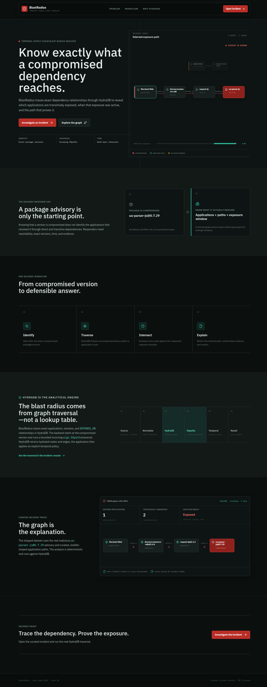
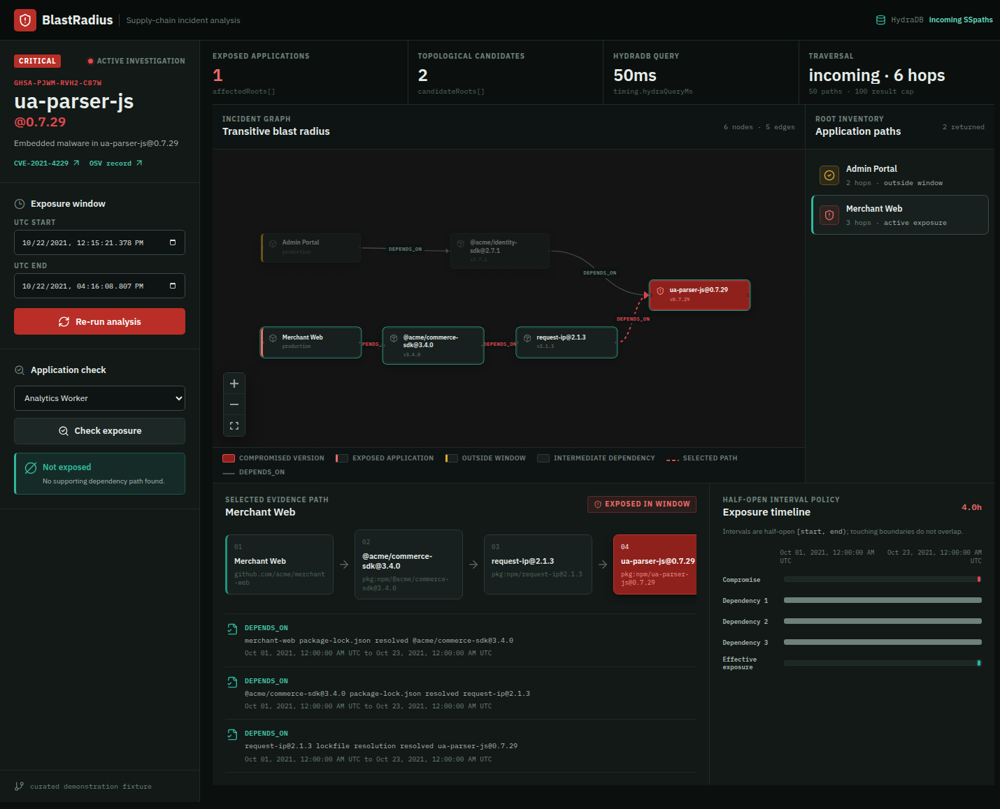

# BlastRadius

BlastRadius is a narrow incident-response console for temporal software supply-chain analysis. Given a compromised package version, it asks HydraDB for the incoming transitive dependency paths, identifies affected application roots, and shows the exact graph evidence for each result.

The product opens at `/` with a concise explanation of the problem and moves
to the real investigation console at `/incident`. The homepage preview is
illustrative; the incident console performs the actual HydraDB-backed query.

The Hack Hydra 2026 submission targets Track 02A: Repos, Dependencies + Code as Graphs.





## The Problem

A package advisory alone does not answer the operational question:

> Which applications were transitively exposed, through what exact dependency chain, while the compromised version was active?

That answer depends on directed, version-specific relationships. Similar package names or semantically related documents cannot prove that an application resolved a compromised version.

## Why A Graph

BlastRadius models applications and exact package versions as nodes. `DEPENDS_ON` relationships point from each consumer to the version it resolved and carry evidence plus a validity interval.

The core operation starts at `ua-parser-js@0.7.29` and traverses incoming `DEPENDS_ON` relationships with HydraDB `algo.SSpaths`. Each hydrated path is then normalized into application-to-package order and evaluated against the requested incident window.

Without HydraDB, the product loses its authoritative reverse transitive traversal and hydrated explanation paths. A vector search can retrieve advisory context, but it cannot establish that:

```text
Merchant Web
  -> @acme/commerce-sdk@3.4.0
  -> request-ip@2.1.3
  -> ua-parser-js@0.7.29
```

## HydraDB's Role

HydraDB is the authoritative property-graph store and traversal engine. BlastRadius uses the verified OSS HTTP interface for:

- deterministic node and relationship ingestion;
- exact application-owned package/version identities;
- exact `DEPENDS_ON`, `HAS_VERSION`, and `AFFECTS` predicates;
- incoming bounded `algo.SSpaths` traversal;
- hydrated nodes, relationships, properties, and path evidence;
- persistent local object-store data.

The frontend never submits arbitrary Cypher. The backend exposes only `analyzeBlastRadius`, `getExposurePath`, and `checkExposure` operations.

## Architecture

```text
OSV/GHSA + curated lockfile-shaped fixture
                  |
                  v
       deterministic normalization
                  |
                  v
        HydraDB property graph
                  |
        incoming algo.SSpaths
                  |
                  v
   path normalization + temporal policy
                  |
                  v
      fixed TypeScript HTTP API
                  |
                  v
       graph-first React console
```

## Data And Ground Truth

The 20-record fixture uses the real malicious `ua-parser-js@0.7.29` advisory `GHSA-pjwm-rvh2-c87w` / `CVE-2021-4229`. OSV identifies `0.7.29` as malicious and `0.7.30` as the fixed version.

The application dependency paths are curated demonstration data. They do not claim to describe real organizations or ecosystem-wide coverage. See [fixture-20-row.md](docs/validation/fixture-20-row.md) and [ground-truth.md](docs/validation/ground-truth.md).

## Temporal Policy

All windows are non-empty half-open intervals `[start, end)` in UTC epoch milliseconds.

A path is exposed only when one common interval exists across:

1. the requested analysis window;
2. the compromised version's interval;
3. every `DEPENDS_ON` relationship validity interval in the path.

Touching boundaries do not overlap. Missing dependency validity produces `unresolved`, not a guessed exposure result. Insertion order is never treated as temporal truth.

## Prerequisites

- Node.js 22 or newer
- pnpm 11
- Docker for the standard HydraDB path

The technical investigation also includes a no-Docker launcher for the exact extracted image used during development, but it assumes the image filesystem already exists at `/tmp/hydradb-rootfs`.

## Setup

Install application dependencies:

```bash
pnpm install --frozen-lockfile
```

Start a single local HydraDB node in terminal one:

```bash
mkdir -p hydradb-data/store hydradb-data/cache
printf '%s\n' 'local-development-token-32-bytes' > hydradb-data/auth-token

docker run --rm \
  --user "$(id -u):$(id -g)" \
  -p 7687:7687 -p 8443:8443 -p 9090:9090 \
  -v "$PWD/hydradb-data:/data" \
  -e CLOUD_PROVIDER=local \
  -e LOCAL_PATH=/data/store \
  -e GRAPH_NAMESPACE=default \
  -e GRAPH_ID=default \
  -e GRAPH_CELL_ID=cell-0 \
  -e GRAPH_CELLS=cell-0 \
  -e GRAPH_NODE_ID=node-0 \
  -e GRAPH_BOLT_NODE_ADDRESSES=node-0=127.0.0.1:7687 \
  -e GRAPH_ADVERTISED_BOLT_ADDR=127.0.0.1:7687 \
  -e GRAPH_DATA_CACHE_DIR=/data/cache \
  -e GRAPH_AUTH_TOKEN_FILE=/data/auth-token \
  -e GRAPH_ALLOW_PLAINTEXT=true \
  -e RUST_MIN_STACK=33554432 \
  ghcr.io/hydra-db/hydradb@sha256:db78309a233be54662db29744047e985a39b51c45a270d1a1f47c31a62cdb709
```

In terminal two, configure the application, ingest twice, and verify the real traversal:

```bash
export HYDRADB_URL=http://127.0.0.1:8443
export HYDRADB_TOKEN=local-development-token-32-bytes
export HYDRADB_NAMESPACE=default
export HYDRADB_GRAPH_ID=default
export HYDRADB_CELL_ID=cell-0

pnpm hydra:acceptance
```

Build and start BlastRadius:

```bash
pnpm build
pnpm start
```

Open `http://127.0.0.1:8787`.

The root `Dockerfile` builds the same Node server for a container host. It
listens on `PORT` (or `BLASTRADIUS_PORT`) and `HOST`, defaulting to
`0.0.0.0`. See [deployment.md](docs/deployment.md) for the separate persistent
HydraDB service and production bootstrap.

For the verified no-Docker development path, start HydraDB with:

```bash
HYDRA_INV_RUNTIME_ROOT=/tmp/blastradius-runtime \
HYDRA_INV_HTTP_ADDR=127.0.0.1:18443 \
HYDRA_INV_BOLT_ADDR=127.0.0.1:17687 \
HYDRA_INV_ADMIN_ADDR=127.0.0.1:19091 \
bash investigation/runtime/run_extracted_image.sh
```

Then set `HYDRADB_URL=http://127.0.0.1:18443` before running the application scripts.

## Example Analysis

The default incident window returns:

| Application | Topological path | Temporal result |
|---|---|---|
| Merchant Web | 3-hop path to `ua-parser-js@0.7.29` | Exposed |
| Admin Portal | 2-hop path to `ua-parser-js@0.7.29` | Not exposed; dependencies begin after the incident window |
| Analytics Worker | No path to the compromised version | No supporting dependency path |

HydraDB performs the incoming traversal. TypeScript applies the explicit temporal intersection policy to the hydrated paths.

## Tests And Validation

Run the static gates:

```bash
pnpm verify:static
```

With HydraDB running, execute the integration contract:

```bash
pnpm hydra:acceptance
```

Available focused commands:

```bash
pnpm fixture:validate
pnpm test
pnpm typecheck
pnpm build
pnpm hydra:ingest
pnpm hydra:verify
pnpm ui:smoke
```

The latest acceptance evidence is in [acceptance.md](docs/validation/acceptance.md). The measured 10k generated graph result is in [performance-10k/result.json](docs/validation/performance-10k/result.json).

The browser smoke harness covers the homepage-to-console transition, loading,
successful graph/path evidence, stale-window protection, mobile layout, and a
controlled HydraDB outage. Captured results are under
`docs/validation/browser-smoke-production-*` and
`docs/validation/browser-error-smoke-production`.

## Measured Performance

On the local single-node extracted-image runtime, the generated 10k-vertex graph measured:

- ingestion: 36.0 seconds, about 555 rows/second;
- cold incoming `SSpaths`: 1.77 seconds;
- warm p50: 21.8 ms;
- warm p95: 36.0 ms.

This is a local generated shape, not an npm ecosystem benchmark. Query results are capped at six hops, 50 paths, and 100 results.

## Limitations

- The product ships one curated incident, not a registry crawler or SCA replacement.
- Application and lockfile evidence is demonstration data; only the advisory/version facts are grounded in OSV/GHSA/npm metadata.
- Temporal truth is application policy over stored intervals; HydraDB does not automatically infer exposure.
- The primary query uses bounded incoming `SSpaths`; reverse unbounded variable-length OpenCypher was not a verified interface.
- The query planner reported full-edge-scan warnings for the small readback/count queries.
- 10k was measured locally. 100k and ecosystem-scale accuracy remain unverified.
- The application uses a single HydraDB node and plaintext local development configuration.
- A public deployment is not included in this repository claim until its
  health endpoint and real graph query have been verified from a clean browser.

## Attribution

- HydraDB OSS, AGPL-3.0: <https://github.com/hydra-db/hydradb>
- OSV record: <https://osv.dev/vulnerability/GHSA-pjwm-rvh2-c87w>
- GitHub advisory: <https://github.com/advisories/GHSA-pjwm-rvh2-c87w>
- React Flow: <https://reactflow.dev/>
- Lucide icons: <https://lucide.dev/>

BlastRadius application code is licensed under the [MIT License](LICENSE). HydraDB and other dependencies retain their own licenses.
